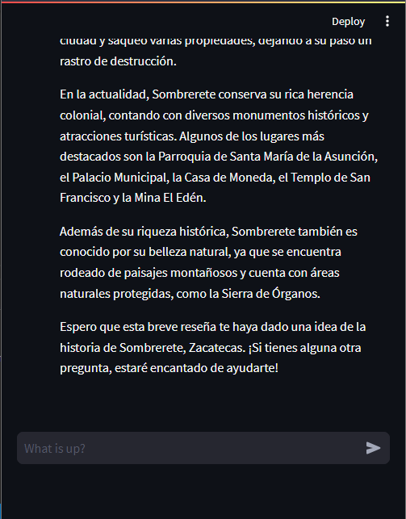
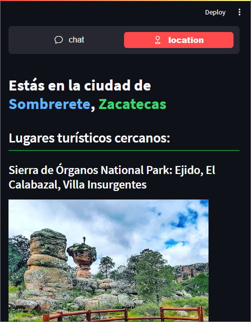
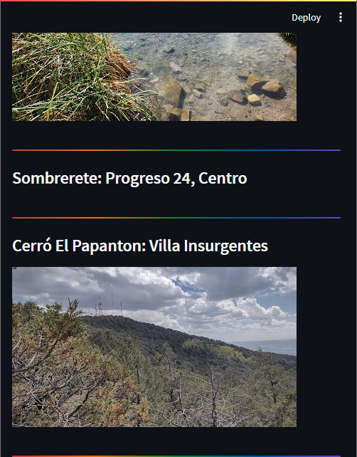
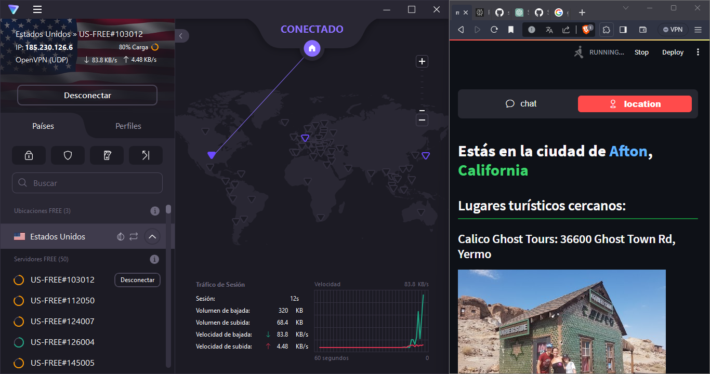

# StreamLit.OpenAI

StreamLit chatbot y ubicación.

## Instalación

En la terminal:

```bash
$ git clone https://github.com/estebansg1/StreamLit.OpenAI.git
```

Librerias usadas en requirements.txt:
```bash
$ pip install -r requirements.txt"
```

## Progama en uso

Se implementa la API de openAI con el modelo de lenguaje chatgpt3.5-turbo.
</img>
</img>

Tambien se uso la API de google places para mostrar los lugares turisticos cercanos.
</img>
</img>

Ejemplo usando un VPN para mostrar datos de diferentes ciudades.
</img>

